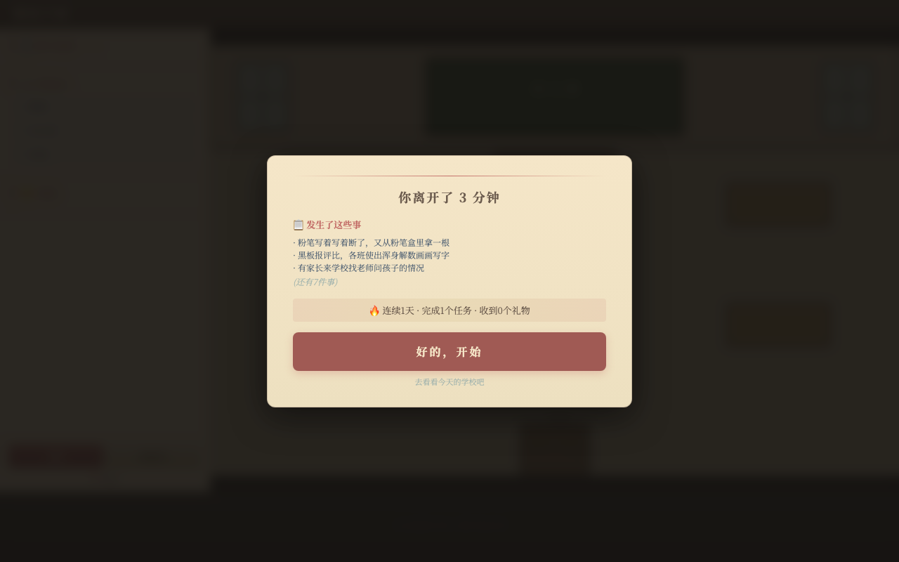
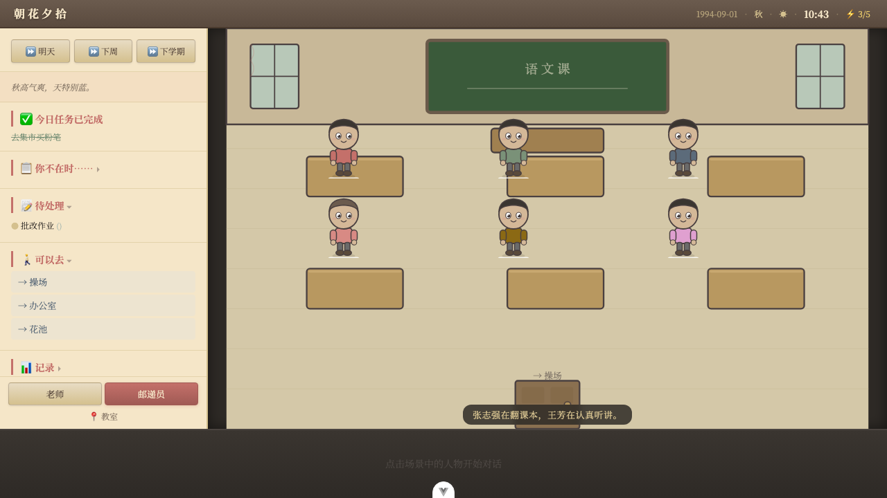
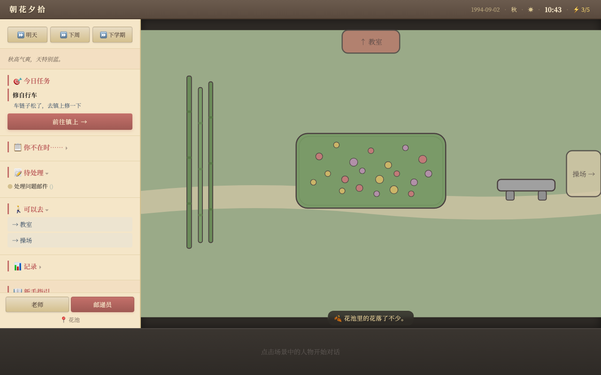
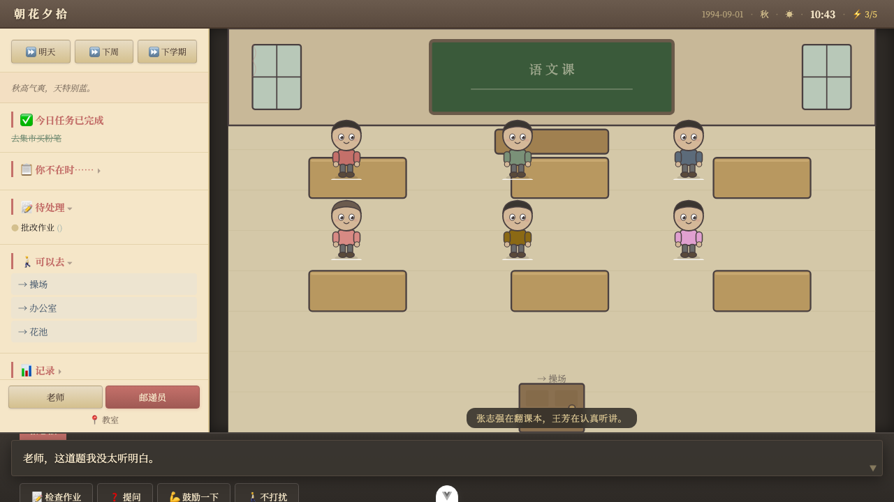

**中文** | [English](./README.md)

# 朝花夕拾

> **状态：** 这不是一个正式的项目。就是觉得好玩，做着玩的。还没做完，也不知道会不会做完，或者"做完"是什么意思。如果你碰巧看到觉得有意思，那挺好的。

> _小时候在华北农村长大，想当两种人。_
>
> _一是邮递员。我们村的邮递员骑一辆绿色自行车，后座驮着大帆布包。他认识村里每一个人。他沿着土路骑过来的时候，狗会叫，小孩会跑出来看有没有在城里打工的爸爸寄回来的信。我觉得那是世上最好的工作——把远方的消息带给想念彼此的人。_
>
> _二是小学老师。我们学校是一排砖房，院子里立着一根旗杆。冬天教室里生煤炉，风向变了会倒灌一屋子烟。老师叫得出每个学生的名字，知道谁家里日子不好过，知道谁需要多鼓励一句。学校有个花池——夏天开月季，冬天只剩竹子。_
>
> _后来长大了，两样都没当成。但有时候还是会想起那个邮递员的车铃声，和教室早晨粉笔灰在阳光里飘的样子。_
>
> _所以做了这个。不算是游戏吧，更像是推开一扇窗，看一看自己没有过过的日子。_

一款生活模拟，体验 1990 年代中国北方农村的日常。扮演一名村小学老师或镇上邮递员，在安安静静的乡村里过日子。

## 游戏截图

| 简报                                   | 教室                                    |
| -------------------------------------- | --------------------------------------- |
|  |  |

| 花池                                      | 对话                                   |
| ----------------------------------------- | -------------------------------------- |
|  |  |

## 功能

- **卡通矢量画风** — SVG 场景，温暖褪色色调，像一本儿童绘本
- **实时世界** — 游戏时间与现实同步，你不在的时候世界继续运转
- **双线体验** — 老师线和邮递员线，随时切换
- **12 个插画场景** — 教室、操场、花池、村路、集市、邮局等
- **NPC 互动** — 11 个角色，有日程、情绪、好感度，上下文选项
- **精力系统** — 每天 5 次深度互动，迫使你做出选择
- **好感门槛** — 低好感 NPC 拒绝说话，高好感 NPC 分享秘密
- **每日任务** — 每天一个目标，一键导航前往
- **冲突事件** — 学生打架、家长生气、窗户碎了——需要你做出决定
- **学期考试** — 学生成绩取决于你的互动
- **故事分支** — 3 条故事线，结局取决于你的选择
- **礼物收集** — 高好感 NPC 会送你东西
- **旅途事件** — 移动时随机触发小故事
- **连续签到** — 每日登录奖励（Wordle/多邻国模式）
- **AI 对话** — 上下文感知的 NPC 对话。支持 DeepSeek、Kimi、MiniMax、OpenAI、Claude
- **308 个测试** — 全面的单元 + e2e 覆盖

## 技术栈

- **前端：** Vue 3、SVG、PixiJS
- **后端：** Nitro
- **数据库：** SQLite (better-sqlite3)
- **工具链：** VitePlus (Vite + Rolldown + Vitest + Oxc)
- **AI：** 多模型适配器（OpenAI 兼容 + Anthropic）

## 快速开始

```bash
# 安装依赖
pnpm install

# 配置 AI API Key
echo 'AI_API_KEY=your-key-here' > .env.local

# 启动开发
pnpm dev          # 前端 (端口 5173)
pnpm dev:server   # 后端 (端口 3001)

# 运行测试
pnpm test
```

## 许可证

MIT
